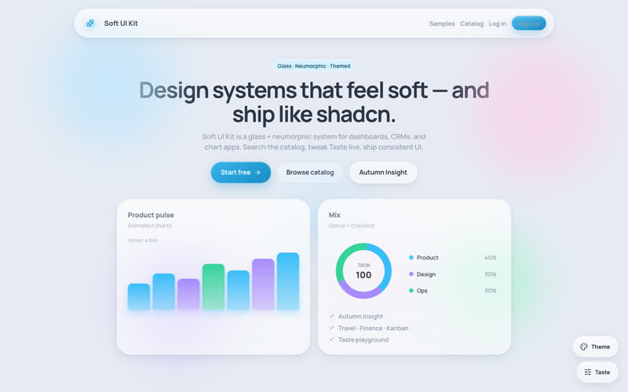
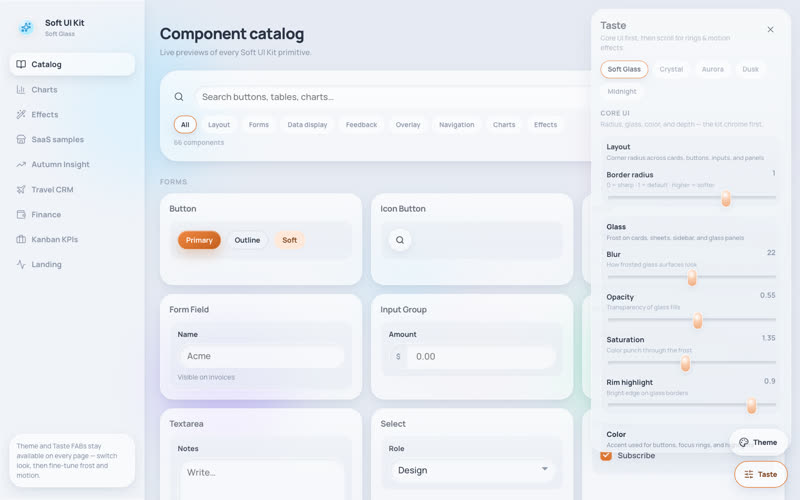
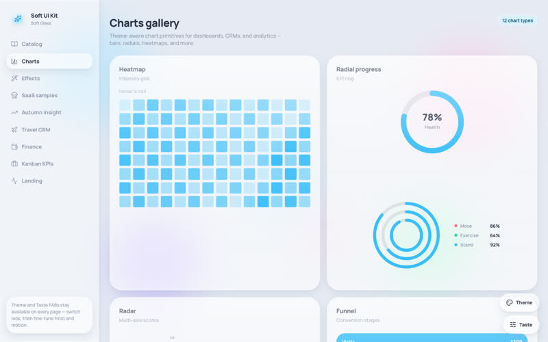
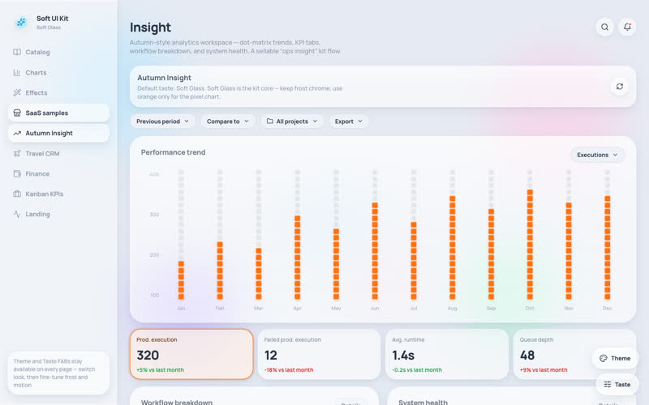
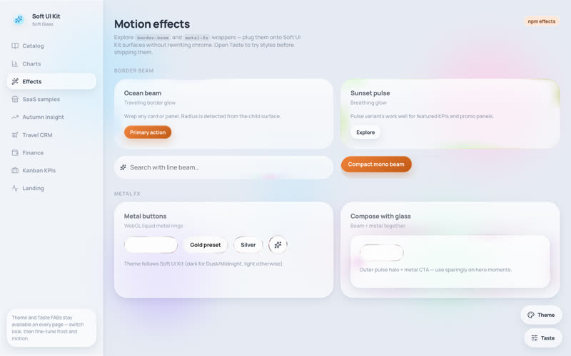
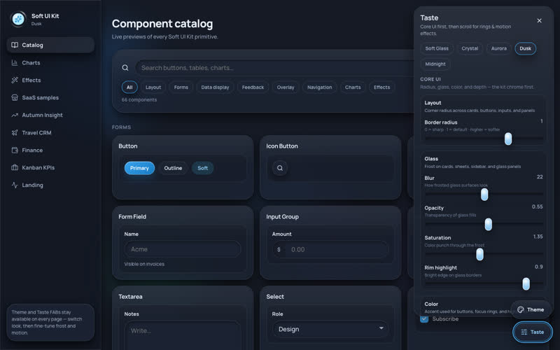

# Soft UI Kit

Glass + soft UI playground — themes, live **Taste** dials, component catalog, charts, motion effects, and SaaS samples.

<p align="center">
  <a href="https://dev-muhammad-junaid.github.io/soft-ui-kit/">
    
  </a>
</p>

<p align="center">
  <a href="https://dev-muhammad-junaid.github.io/soft-ui-kit/"><strong>Live demo →</strong></a>
  &nbsp;·&nbsp;
  Open <strong>Taste</strong> (bottom-right) to tweak radius, glass, color, and effects live
</p>

---

## What's in the box

| Landing | Catalog + Taste |
| :---: | :---: |
|  |  |
| Marketing hero with glass cards & charts | Searchable component previews + live Taste dials |

| Charts gallery | SaaS sample |
| :---: | :---: |
|  |  |
| Line, bar, heatmap, radar, funnel & more | Autumn Insight analytics workspace |

| Motion effects | Dark theme |
| :---: | :---: |
|  |  |
| `border-beam` + `metal-fx` playground | Dusk / Midnight + Shift+1…N theme switch |

---

## Features

- **5 themes** — Soft Glass, Crystal, Aurora, Dusk, Midnight
- **Taste playground** — radius, blur, opacity, accent hue, depth, glass rings, border-beam & metal-fx
- **Component catalog** — buttons, forms, overlays, navigation, charts, effects
- **SaaS samples** — Autumn Insight, Travel CRM, Finance, Kanban
- **Charts** — interactive gallery with soft glass chrome

## Local

```bash
npm install
npm run dev
```

Build / preview (Pages base path `/soft-ui-kit/`):

```bash
npm run build
npm run preview
```

Regenerate README screenshots from the live site:

```bash
npm run preview:capture
```

## Stack

- React 19 + Vite + React Router
- CSS tokens + Taste playground
- Icons: [`@phosphor-icons/react`](https://phosphoricons.com/) (light strokes for glass UI)
- Optional packs: [`border-beam`](https://www.npmjs.com/package/border-beam), [`metal-fx`](https://www.npmjs.com/package/metal-fx)
